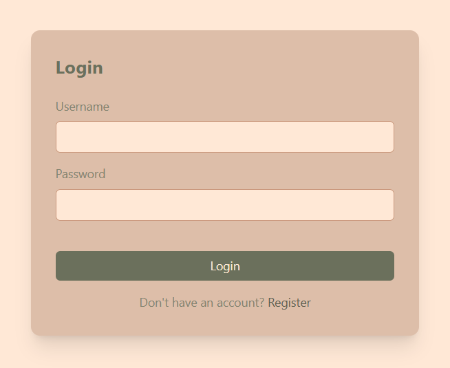
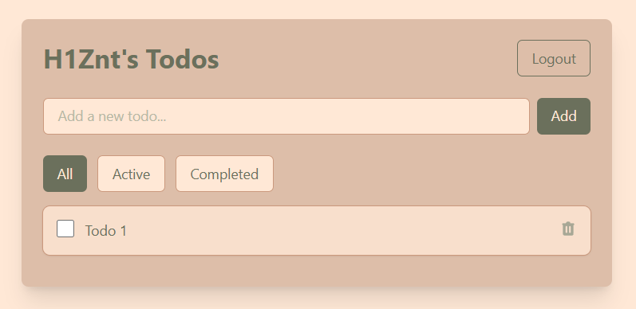

# Todo App (FullStack)

## Cервис/приложение "Список задач" (Todo List) с аутентификацией и хранением данных на сервере.

## Стек:

> *React, Redux Toolkit, RTK Query, Tailwind CSS, TypeScript, Vite, Axios, Node.js (Express), nodemon, SQLite и JWT-аутентификация.*

---

## Папки в проекте:

> ***client - Фронтенд часть***

> ***server - Бэкенд часть***

---

## Установка и запуск

> ***установка зависимостей на сервер(server)***
>> с помощью команды - (npm install) или (npm i).

> ***установка зависимостей на клиент(client)***
>> с помощью команды - (pnpm install) или (pnpm i).

> ***запуск бэкенда(server)***
>> с помощью команды - (npm run dev).

> ***запуск фронтенда(client)***
>> с помощью команды - (pnpm run dev).

## [Веб приложение](https://todo-app-full-stack-fawn.vercel.app/  "Ссылка на сайт")

## Внешний вид приложения:

* Атворизация

* Задачи

